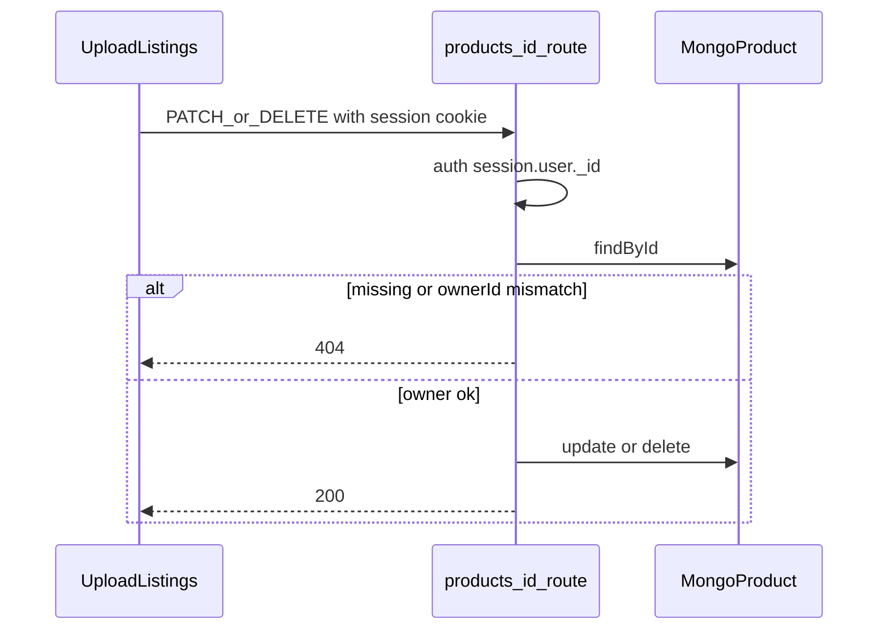

# Seller trust follow-up: update and delete

## Goal

Let authenticated sellers update and remove **their own** products so “Your listings” is manageable. Non-owners must not mutate others’ listings.

## Approach

Add a dynamic route handler and thin client UI on the existing upload page. Do **not** change create/`GET` list behavior. Skip Firebase Storage cleanup for now (orphaned images stay a known limit — no Admin SDK today).

## Implementation

### 1. API: `[app/api/products/[id]/route.ts](app/api/products/[id]/route.ts)`

Mirror auth style from `[app/api/products/route.ts](app/api/products/route.ts)`:

- **DELETE**: `auth()` → 401 if no `session.user._id`; load product by `id`; if missing or `ownerId !== session.user._id` → **404** (no existence leak); else `deleteOne` / `findByIdAndDelete`; return `{ ok: true }` (or deleted doc).
- **PATCH**: same auth/ownership gate. Accept **JSON** body with optional `name`, `weight`, `price`, `tags` (comma string or string array → normalized array), `imageUrl`. Reject attempts to set `ownerId`. Validate that at least one allowed field is present; coerce numbers like create does. Return updated product.
- Invalid ObjectId → 404.

### 2. UI on `[app/upload/page.tsx](app/upload/page.tsx)`

Listings today are display-only. Extract a small client component (e.g. `components/UploadForm/OwnedProductCard.tsx` or sibling under `components/`) that:

- Renders the existing image/name/weight/price/tags.
- **Delete**: confirm, then `DELETE /api/products/:id`, then `router.refresh()`.
- **Edit**: inline fields for name / weight / price / tags; save via `PATCH` JSON (no image replace in this pass — keeps client Firebase flow out of scope). Cancel restores prior values.

Preserve RSC auth gate + `getProducts({ ownerId })` on the page; only the card is client.

### 3. Tests: `[app/api/products/[id]/route.test.ts](app/api/products/[id]/route.test.ts)`

Same mock pattern as `[app/api/products/route.test.ts](app/api/products/route.test.ts)`:

- DELETE/PATCH → 401 when unauthenticated
- DELETE/PATCH → 404 when missing or wrong `ownerId`
- DELETE success when owner matches
- PATCH updates allowed fields when owner matches; does not call update when unauthorized

### 4. Docs

Update README Known limits / routes table: remove “No product update/delete APIs yet”; document `PATCH`/`DELETE /api/products/[id]` (session + owner). Note Firebase images are not deleted on product delete.

Plan tracking stays in this file under [`.cursor/plans/`](.cursor/plans/) (already indexed in [`.cursor/plans/README.md`](README.md)): flip frontmatter todo statuses as work lands; fill `## Divergences` when done (no separate `docs/plans/` Outcome).

## Out of scope

- Committing the existing ownerId backfill work (separate commit)
- Running the Atlas `--apply` backfill
- Firebase Storage object deletion
- Image replace on edit
- Public shop edit surfaces beyond `/upload`

## Divergences

- Follow-up hardening after review: PATCH rejects null/non-object bodies, non-finite weight/price, empty/non-string name and imageUrl; OwnedProductCard validates name + numeric weight/price before save.
