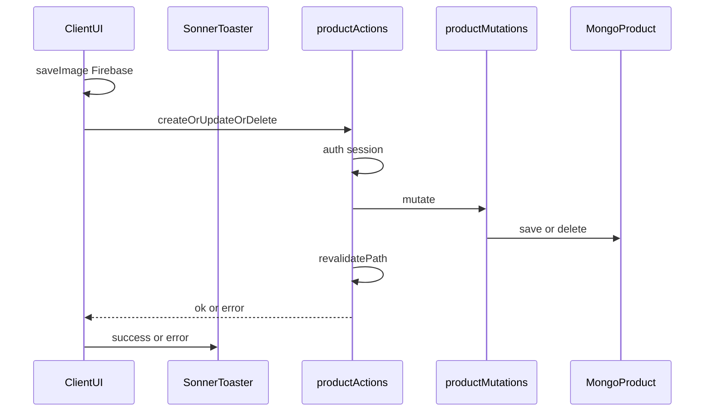

# Server Actions, loading UI, and feedback

## Goal

Use Server Actions for seller product mutations (create / update / delete), add loading UX for slow RSC data fetches on home and `/upload`, and give clear user feedback: **toasts for same-page mutations**, **inline errors for auth forms**, **a persistent banner after register**, and **no toast on logout**.

## Feedback model (why)

| Event | Feedback | Why |
|-------|----------|-----|
| Product create / update / delete success or error | Toast (sonner) | Same page; ephemeral “it worked / failed” is the usual CRUD pattern |
| Login / register submit errors | Inline under the form (keep today’s pattern) | Stays visible, tied to the form; better for accessibility than a disappearing toast |
| Register success | Green banner on login after redirect (`?registered=1`) | User must see “account created — please log in”; banners beat toasts for next-step messaging |
| Logout (user clicked Sign out) | None — land on login | Industry norm: the login screen *is* the confirmation. Toast/`?toast=` not used |
| Login success | None — enter the app | Redirect is enough |

No `?toast=` query params. The only query handoff is `?registered=1` for a **banner**, not a toast.

## Approach

Extract auth + Mongo mutation logic into shared helpers. Server Actions call those helpers and `revalidatePath`. Client forms call the actions. Keep existing `/api/products` Route Handlers as thin wrappers over the same helpers so current Jest tests and the public GET list stay valid.

Add **sonner** for mutation toasts only: mount `<Toaster />` inside [`components/Provider.tsx`](components/Provider.tsx). Replace the create Success modal with `toast.success` / `toast.error`.

Firebase image upload stays client-side (`saveImage`); create action receives the resulting `imageUrl` string.

## Implementation

### 1. Shared mutation helpers

Add [`utils/products/mutations.ts`](utils/products/mutations.ts) with the logic currently in:

- [`app/api/products/route.ts`](app/api/products/route.ts) `POST`
- [`app/api/products/[id]/route.ts`](app/api/products/[id]/route.ts) `PATCH` / `DELETE`

Functions return `{ ok: true, result? } | { ok: false, status: number, error: string }` so actions and routes share ownership / validation rules.

### 2. Server Actions

Add [`app/actions/products.ts`](app/actions/products.ts) with `"use server"`:

- `createProduct(input)` — `auth()`; reject if no `session.user._id`; create via helper with `ownerId`; `revalidatePath('/')` and `revalidatePath('/upload')`
- `updateProduct(id, input)` — same ownership gate as today’s PATCH; revalidate those paths
- `deleteProduct(id)` — same as DELETE; revalidate those paths

Do **not** migrate signup or Auth.js credentials to Server Actions in this pass.

### 3. Toast infrastructure (sonner) — mutations only

- `npm install sonner`
- In [`components/Provider.tsx`](components/Provider.tsx), render `<Toaster position="top-center" richColors closeButton />`.
- Do **not** add a toast query-param listener.

### 4. Wire product UI to actions + toasts

- [`components/UploadForm/UploadForm.tsx`](components/UploadForm/UploadForm.tsx): after `saveImage`, call `createProduct`. Pending button (“Adding…”). Success: `toast.success("Product posted")`; remove [`Success`](components/UploadForm/Success.tsx) modal (delete file if unused). Failure: `toast.error(...)`. Leave sign-out as `signOut({ callbackUrl: '/account/login' })` with **no** toast query.
- [`components/UploadForm/OwnedProductCard.tsx`](components/UploadForm/OwnedProductCard.tsx): call `updateProduct` / `deleteProduct`; drop `router.refresh()` when actions revalidate. Pending Save/Delete labels. Success/error via toast; remove the inline red error paragraph on the card.

### 5. Auth feedback (no logout toast)

- [`components/Users/LoginForm.tsx`](components/Users/LoginForm.tsx): keep inline `submitError` for bad credentials / network failures. If `searchParams` has `registered=1`, show a dismissible/static success banner (“Account created. Please log in.”), then `router.replace` to strip the query (optional cleanup).
- [`components/Users/CreateAccountForm.tsx`](components/Users/CreateAccountForm.tsx): on success, `router.replace('/account/login?registered=1')`. Keep inline `submitError` for signup API failures.
- Logout call sites ([`NavPanel`](components/Nav/NavPanel.tsx), [`Greet`](components/Greet.tsx), UploadForm): unchanged `callbackUrl: '/account/login'` — **no toast**.

### 6. Thin API wrappers

Rewrite product Route Handlers to parse the request, call shared helpers, return the same HTTP statuses. Jest under `app/api/products/` keeps covering HTTP behavior.

### 7. Loading UI patterns

**Route loading**

- Add [`app/upload/loading.tsx`](app/upload/loading.tsx) — skeleton for title + listing placeholders.
- Skip root [`app/loading.tsx`](app/loading.tsx).

**Suspense on home**

- Split product fetch out of [`app/page.tsx`](app/page.tsx): Hero / ShopbyCateg / FeaturedCard stay immediate; wrap async `FeaturedSection` in `<Suspense fallback={<FeaturedSkeleton />}>`.
- Add [`components/Featured/FeaturedSkeleton.tsx`](components/Featured/FeaturedSkeleton.tsx) (RSC).

**Action pending UI**

- Upload form and owned-card buttons: disabled + “Saving…” / “Deleting…” / “Adding…” while the action runs.

### 8. Docs / plan index

- README: note Server Actions for product writes; API table unchanged; toast used for listing mutations.
- After execution: plan under [`.cursor/plans/`](.cursor/plans/) per plan-docs, index in [`.cursor/plans/README.md`](.cursor/plans/README.md), fill Divergences.

## Out of scope

- Migrating signup / login to Server Actions
- Removing `/api/products` routes
- Firebase Storage cleanup on delete
- Image replace on edit
- Toast on logout or login success
- Toast for auth form validation/submit errors (inline only)
- `?toast=` query handoff
- Custom toast design beyond sonner defaults + `richColors`
- `useFormStatus` with native `action=` forms
- Root `app/loading.tsx`
- Playwright coverage for toasts/actions

## Divergences

- Create helper now validates name / weight / price / imageUrl before save (API POST previously passed form fields through more loosely); existing Jest cases still pass with valid payloads.
- Register banner is static (not dismissible); query is stripped via `router.replace` on mount.
